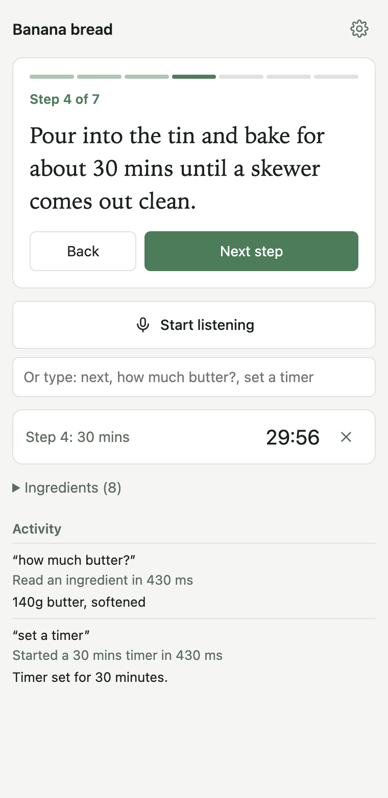
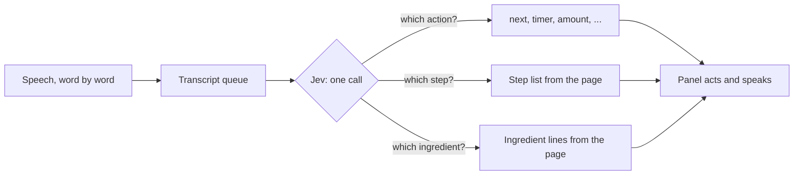

<div align="center">


# Recipe Mode

**Cook hands-free on any recipe page.** Say "next", "how much butter?" or "set a timer" while your hands are covered in flour.

[](https://github.com/dgr8akki/recipe-mode/actions/workflows/ci.yml)
[](LICENSE)


<picture>
  <source media="(prefers-color-scheme: dark)" srcset="docs/screenshot-dark.png" />
  
</picture>

</div>

## Features

- **Works on any recipe site.** Reads the schema.org recipe data most sites publish for search engines, with a fallback for simple pages.
- **Talk naturally.** "What was that?", "go to the step where I pour it into the tin", "honey, pass the salt" (ignored: that wasn't for you).
- **Answers out loud** and highlights the current step on the page, so you rarely need to look.
- **Smart timers.** "Set a timer" uses the time in the current step. When a step mentions two times, it picks the one you meant.
- **Fast.** Simple commands like "next" act before you finish the sentence.
- **Private by default.** On-device speech recognition where Chrome supports it. No accounts, no analytics.

## How it works

Recipe Mode is built on [Jev](https://typesafe.ai), TypeSafe's System One model. Jev doesn't generate text, it answers typed questions with probabilities, so it **never makes anything up**: every step, ingredient and time the assistant reads to you comes straight from the recipe.



Each spoken phrase becomes one request carrying several questions (action, step, ingredient, and which timer if a step has several). Jev picks from lists that the extension builds from the page. Cooking times are parsed deterministically, including fractions such as "1 ½ hours" and ranges such as "25-30 minutes".

## Install

Recipe Mode isn't on the Chrome Web Store yet. To install from source:

1. Download the latest `recipe-mode-x.y.z.zip` from [Releases](https://github.com/dgr8akki/recipe-mode/releases) and unzip it, or clone this repo.
2. Open `chrome://extensions` and turn on **Developer mode**.
3. Click **Load unpacked** and select the unzipped folder (or `src/` in a clone).
4. Pin **Recipe Mode** from the puzzle-piece menu.

You need an [AI Gateway API key](https://vercel.com/docs/ai-gateway/authentication-and-byok/api-keys) from Vercel. Jev costs $0.042 per million input tokens (about $0.0001 per command). Set a [spend limit](https://vercel.com/docs/ai-gateway/observability-and-spend/budgets) on the key you use.

> [!NOTE]
> Use Google Chrome. Brave ships no working speech recognition; you can still type commands there.

## Usage

1. Open a recipe, then click the Recipe Mode icon to open the side panel.
2. Open **Settings**, paste your API key and select **Save**. The panel checks the key.
3. Select **Start listening**. The first time, Chrome asks for microphone access in a new tab.

| Say                                                          | What happens                                                   |
| ------------------------------------------------------------ | -------------------------------------------------------------- |
| "Next", "go back", "what was that?", "start over"            | Moves between steps and reads the step aloud                   |
| "Go to step 4", "go to the step where I add the eggs"        | Jumps to that step                                             |
| "How much butter?"                                           | Reads the ingredient line, for example "140g butter, softened" |
| "What do I need for this step?", "what are the ingredients?" | Lists the ingredients for this step, or all of them            |
| "Set a timer", "set a timer for 12 minutes"                  | Starts a timer from the step's own time, or the time you say   |
| "How long is left?", "cancel the timer"                      | Reads or cancels timers                                        |
| "Stop"                                                       | Stops reading, even mid-sentence                               |

You can type any command in the box under the microphone button.

## Privacy and permissions

| Permission                | Why                                                                  |
| ------------------------- | -------------------------------------------------------------------- |
| `sidePanel`               | Shows the assistant next to the recipe                               |
| `scripting`, `<all_urls>` | Reads the recipe on the tab you're viewing and highlights the step   |
| `storage`                 | Keeps your API key and settings in this browser                      |
| Microphone                | Hears commands; audio is transcribed by the browser and never stored |

Your transcript and the recipe's steps and ingredients are sent to Vercel AI Gateway, which forwards them to TypeSafe to run Jev. Nothing else leaves your browser. See [PRIVACY.md](PRIVACY.md).

## Development

Requires Node.js 22 or later.

```sh
npm install
npm run check      # lint + format check + unit tests
npm run eval       # live evaluation against Jev (needs AI_GATEWAY_API_KEY in .env)
npm run package    # builds dist/recipe-mode-<version>.zip for the Chrome Web Store
```

| Script            | Purpose                                                     |
| ----------------- | ----------------------------------------------------------- |
| `npm test`        | Unit tests with `node:test`; Jev is faked, runs offline     |
| `npm run lint`    | ESLint                                                      |
| `npm run format`  | Prettier                                                    |
| `npm run eval`    | Real Jev calls on 16 spoken phrases; waits out rate limits  |
| `npm run icons`   | Renders `assets/icon.svg` to PNGs with headless Chrome      |
| `npm run package` | Zips `src/` for upload and checks the version numbers match |

### Project structure

```
src/
├── manifest.json
├── background.js          Opens the side panel; locks the key to extension pages
├── panel/                 Side panel UI (HTML, CSS, controller)
├── permission/            One-time microphone permission page
└── lib/
    ├── assistant.js       Builds Jev questions and turns answers into intents
    ├── durations.js       Finds cooking times in text ("1 ½ hours", "25-30 mins")
    ├── jev.js             Jev client: retries, rate-limit pauses, clear errors
    ├── page.js            Functions injected into the recipe tab
    ├── queue.js           One request in flight; newest partial wins
    ├── speaker.js         Reads answers aloud; mutes the mic while talking
    ├── speech.js          Word-by-word speech recognition, on-device first
    └── timers.js          Kitchen timers
test/                      Unit tests (jsdom for page functions)
evals/                     Live evaluation against Jev
```

### Tests

- **Unit tests** fake Jev and run in about a second. They cover time parsing, intent rules, the Jev client's retry and rate-limit handling, recipe extraction from real-world JSON-LD shapes, and the manifest.
- **The live evaluation** checks that real phrases map to the right intent with the real model. It isn't part of CI because it needs a key and TypeSafe rate-limits bursts.

## Troubleshooting

| Problem                                           | Fix                                                                                                           |
| ------------------------------------------------- | ------------------------------------------------------------------------------------------------------------- |
| "Open a recipe to start" on a recipe              | Reload the page. The site may not publish recipe data; the heading fallback covers simple pages only.         |
| "Speech recognition can't reach Google's servers" | You're in Brave or behind a VPN that blocks Google speech. Use Chrome, or type commands.                      |
| "Jev is busy. Try again in 30s."                  | TypeSafe is overloaded. Wait, then repeat the command.                                                        |
| "Your API key was rejected"                       | Check the key in Settings. New Vercel accounts need a card on file before AI Gateway serves requests.         |
| Nothing happens when you speak                    | Check that your words appear under the button. If not, allow Chrome in macOS Privacy & Security → Microphone. |

## Limitations

- Timers live in the side panel. Closing the panel clears them.
- While Recipe Mode is talking, only "stop" is heard, so it doesn't react to its own voice.
- Reads the recipe from the page you open. It can't follow a recipe inside an embedded video.

## License

[MIT](LICENSE) © 2026 Aakash Pahuja
